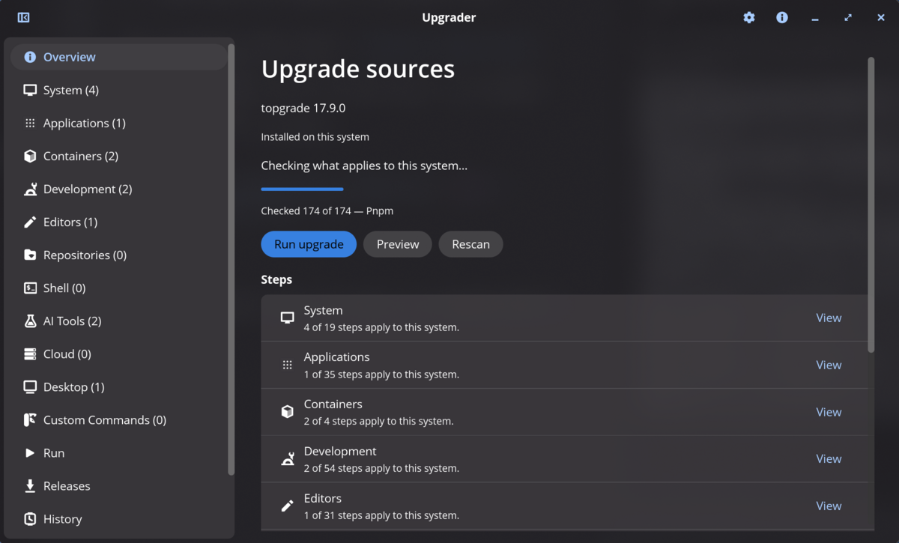
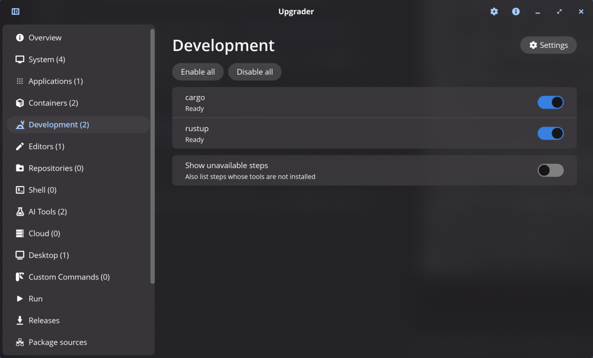
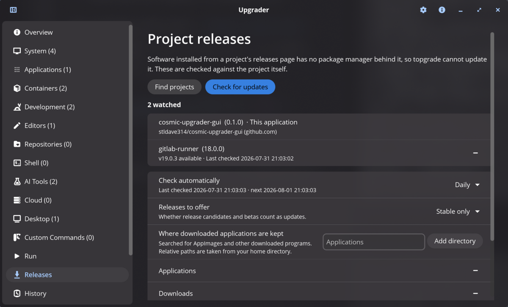
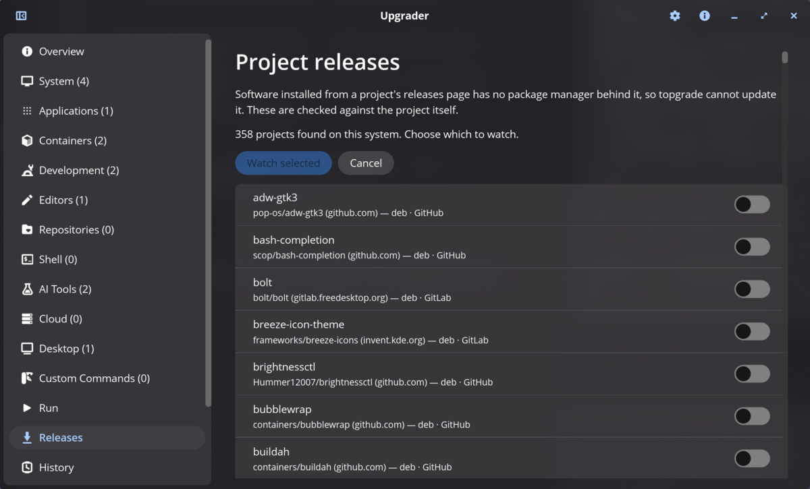
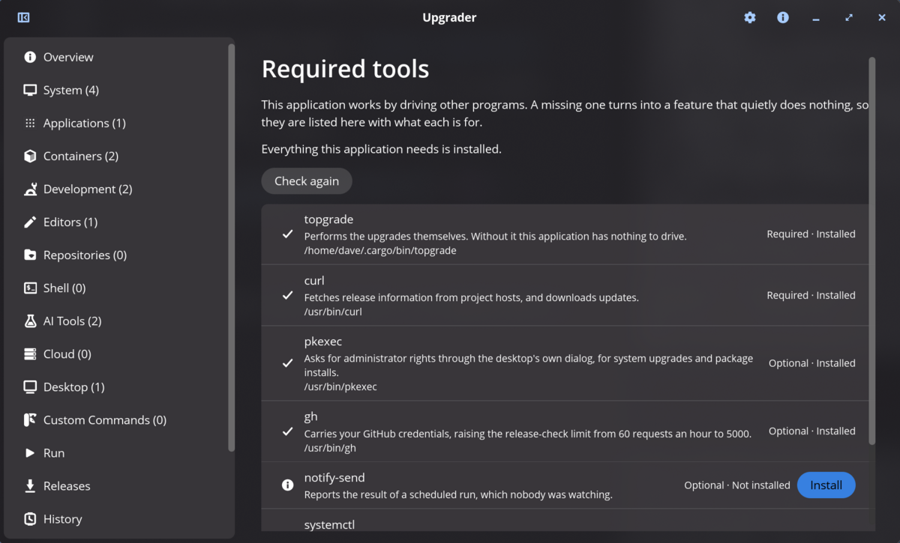
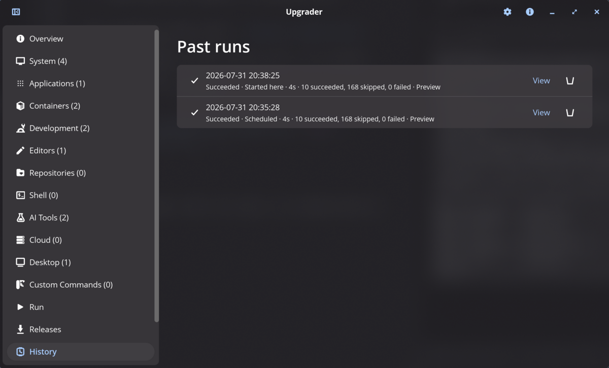
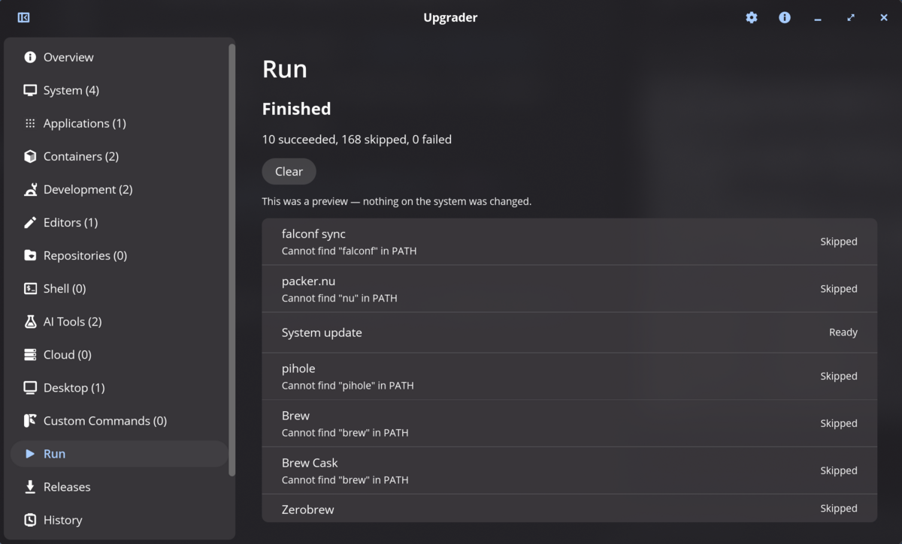
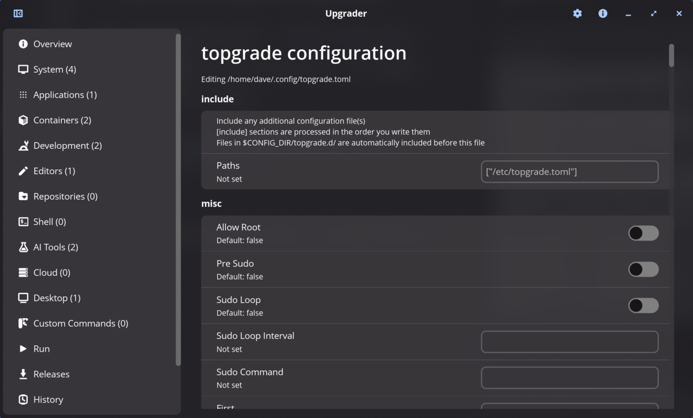
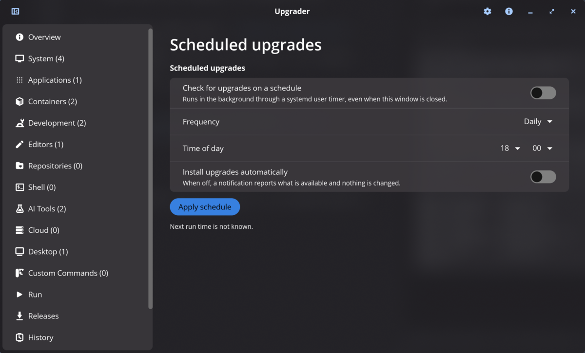

# Upgrader

A COSMIC Desktop front-end for [topgrade](https://github.com/topgrade-rs/topgrade).

topgrade is the best upgrade tool on Linux — it knows about 174 different things
that might need updating, from `apt` and Flatpak to Rust toolchains, JetBrains
plugins and Docker images. What it does not have is a way to see all of that at a
glance, decide what you want, and leave it running on a schedule.

That is what this is. It shows what topgrade can do *on your machine*, groups it
into categories, lets you switch each step on or off, edits topgrade's own
configuration through a form, runs the upgrade with live progress, and keeps a
schedule for unattended runs.



## Nothing about topgrade is hard-coded

This is the design decision everything else follows from. There is no list of
steps in this codebase, no list of configuration options, and no built-in idea of
what your system has installed. All three are read from the topgrade binary at
startup:

| What | Where it comes from | On topgrade 17.9.0 |
| --- | --- | --- |
| The step list | `topgrade --help` | 174 steps |
| Every configuration option | `topgrade --config-reference` | 36 sections, 122 settings |
| What applies to this machine | `topgrade --dry-run --only <step>` | ~1.5 s for a full scan |

So when topgrade adds a step or an option, it appears here without this
application changing at all — with a control of the right kind, and topgrade's
own documentation as its help text.

The one thing topgrade does not provide is presentation: it has no notion of
categories, and its step identifiers are terse (`gnome_shell_extensions`,
`pip_review_local`). Those live in `src/topgrade/categories.rs`, and they affect
**only** which heading a step is filed under. A step that table has never heard
of is still discovered, still probed, still shown and still runnable — it just
appears under **Other**. Letting that table go stale costs you a vaguer heading,
never a missing feature.

## Only what applies to you

topgrade's step list is the same everywhere: it offers `winget`, `macports` and
`chocolatey` on Linux just as readily as on Windows or macOS. Showing all 174
would bury the dozen that matter — on a typical desktop only around 13 have
anything to do.

So every step is probed by running it in dry-run mode, which makes topgrade do
its own detection and report the result. That is authoritative in a way that
looking for binaries on `PATH` could never be: the `restarts` step stands down
when the package manager is going to handle it, and `clam_av_db` checks whether a
systemd timer already does the job.

Each step ends up in one of four states:

- **Ready** — has something to do.
- **Unavailable** — hidden by default, with topgrade's own reason shown when you
  turn them on: *Cannot find "flatpak" in PATH*, *Path "~/.bash_it" doesn't
  exist*. That wording is usually all you need to fix it.
- **Not applicable** — produced no output at all. Either it does not apply to
  this platform, or it has nothing configured yet.
- **Deprecated** — topgrade says the step is on its way out.

Steps are also not one-to-one with results. `shell` reports seventeen plugin
managers; `vim` reports four. Those are shown as components under the step.



Unavailable steps are hidden by default — on a typical system they are most of
the list. The gear beside the heading opens the topgrade settings belonging to
that category, so `[cargo]` and `[rustup]` are reachable from Development rather
than by hunting down a long configuration page.

## Features

- **Vertical category sidebar** with a live count of what is ready in each.
- **Per-step toggles** that write to topgrade's `misc.disable`, so a change here
  means the same thing as one made by hand or with `--disable`.
- **Configuration editor** generated from `--config-reference`. Toggles for
  booleans, dropdowns where topgrade documents allowed values, number and text
  fields elsewhere — with its prose as the description and its stated default
  shown when a value is unset.
- **Preview mode** that runs topgrade dry, so you can see exactly what would
  happen before committing to it.
- **Live run view** with the current step, streaming output that follows the
  newest line, and a per-step summary when it finishes. Scroll up to read
  something and it stops following; scroll back to the bottom and it resumes.
- **Scheduled runs** through a systemd user timer, so they happen when the window
  is closed. Automatic installation is opt-in.
- **Run history**: every run, manual or scheduled, is recorded with its full
  transcript and browsable by timestamp.
- **Failure notifications**, including for scheduled runs nobody was watching.
- **Custom commands** you name yourself, added and removed from the interface.
- **Per-category settings**: the gear on a category page opens exactly the
  topgrade settings that relate to it.
- **Start with the session**, and an optional icon in the panel's status area.
- **Release tracking** for software installed outside a package manager, against
  GitHub, GitLab, Gitea and Forgejo — including self-hosted instances.
- **Updates itself** the same way, whatever it was installed from.
- **A dependency check** saying what each tool it drives is for, whether it is
  required, and whether you have it.

## Release tracking

topgrade covers everything with a package manager behind it. What it cannot
cover is software installed by downloading a `.deb`, an `.rpm` or an AppImage
from a project's releases page — there is no repository to ask. Those are
exactly the things that quietly fall years behind.

**Any forge, not just GitHub.** That is not a nicety: on the machine this was
developed against, discovery found 360 projects across eight distinct hosts —
`github.com`, four different GitLab instances including `invent.kde.org` and
`salsa.debian.org`, `codeberg.org`, and `gitlab.dkrz.de`, which nothing had
heard of. Three API shapes cover all of it:

| Software | Releases endpoint |
| --- | --- |
| GitHub | `/repos/{path}/releases` |
| GitLab | `/api/v4/projects/{escaped path}/releases` |
| Gitea / Forgejo | `/api/v1/repos/{path}/releases` |

A host recognised by name is asked once. One that is not is tried in each shape
until one answers, so a self-hosted instance works without being listed
anywhere.

### It watches itself

This application is listed first and always, whatever it was installed from.
The entry is synthesized from the repository and version compiled into the
binary rather than discovered from a package database — so a build from source,
where there is no file to find and nothing installed to read, still gets update
notices. It has no "stop watching" button, because that is not a thing to turn
off.

### Where the projects come from

Nothing is guessed at from the network. Candidates are derived from what the
installed archives already say about themselves, and then confirmed by you:

1. **An AppImage's embedded update information.** Type-2 AppImages carry a
   `.upd_info` ELF section holding exactly what is needed —
   `gh-releases-zsync|owner|repo|latest|App-*.AppImage.zsync`. That is the
   archive stating where it came from, so nothing is inferred. The section is
   read directly rather than by shelling out to `objcopy`, which would make this
   depend on binutils.
2. **`Homepage:` from dpkg and `%{URL}` from rpm.** 2310 entries on this machine,
   of which a third name a forge.
3. **The filename**, for an AppImage with no update information — which is most
   of them. That gives a name and a version but no project, so those are listed
   for you to point at a repository yourself.

Projects sharing a repository are offered once: a library and its `-dev` package
are the same update.

### Versions

Release tags in the wild are `v1.2.3`, `release-1.2.3`, `qFlipper-1.3.3`,
`2024-01-15` and `1.2.3-rc1`; the installed side adds `2:1.2.3-2ubuntu0.1` and
`1.2.3~beta1`. Comparison reduces both to their numbers, with two rules worth
knowing:

- A Debian revision is **not** a pre-release — `1.2.3-2ubuntu0.1` is the same
  upstream version as `1.2.3`, and treating the revision as a pre-release would
  report a downgrade as an upgrade.
- A dash separates components in a date-style version but ends a dotted one, so
  `2024-01-15` and `1.2.3-2ubuntu0.1` are both read correctly.

When a version cannot be reduced to anything comparable, that is reported as
such — the entry says a release was published rather than claiming it is newer.

### Updating

Assets are scored, not pattern-matched: a release page holds several
architectures, several formats, checksums, signatures and sometimes debug
symbols. The format is required and the architecture is scored, because plenty
of projects ship one portable build with no architecture in its name. A wrong
architecture is rejected outright rather than ranked low — installing an `arm64`
package on an `x86_64` machine wastes an authentication prompt to produce an
error. When nothing matches, the release page is offered instead of a guess.

Packages install through the distribution's own tool under `pkexec`, so the
authentication dialog names what is about to run. An AppImage is replaced in
place — written alongside and renamed over, carrying the original's permissions,
so an interrupted replacement cannot leave a half-written file where a working
program was.



Discovery proposes what it found and you choose — a `Homepage:` field is a hint
about where a project lives, not a promise that its releases are what got
installed:



### Stable only, or betas too

**Releases to offer** decides whether release candidates and betas count. Both
signals are read: the forge's own pre-release flag, *and* the tag — plenty of
projects tag `v2.0.0-rc1` and never tick the box on the release page, and
somebody who asked for stable versions should not be shown one anyway.

### Where downloaded applications live

Where people keep downloaded programs is a matter of habit, so the search
directories are a setting rather than a fixed list. `~/Applications`,
`~/Downloads`, `~/.local/bin`, `~/bin` and `~/AppImages` are searched by
default; relative paths are taken from your home directory and absolute ones
used as given, so somewhere outside home works too.

### How often

Forges are other people's servers, and a watch list of a few hundred projects
polled on every launch is impolite at best and rate-limited at worst. Automatic
checking is capped — **Daily** by default, with **Every 6 hours**, **Weekly** and
**Only when asked** as alternatives. The page shows when it last checked and
when the cap next lifts, so "nothing happened when I opened it" has a visible
reason.

The **Check for updates** button is never blocked by the cap: it is a deliberate
act. Results are remembered against each watched project, so the page says
something after a restart without going back to the network.

### Requests

Through `curl`, and through `gh` for GitHub when it is installed. `gh` carries
your credentials and gets 5000 requests an hour where an unauthenticated client
gets 60 — a watch list of any size exhausts that immediately. Both are detected
rather than assumed; if neither is present the page says so once instead of
every row reporting the same failure.

## Dependencies

Almost everything here is done by driving another program. That is deliberate,
but it has a cost: a missing tool turns into a feature that quietly does
nothing, and you have no way to know which tool or why. So the list is explicit,
checked at first run, and available afterwards.



Each entry says what it is for, whether it is **required** or **optional**, and
where it was found — "which `curl` is it actually using" is the question asked
when a tool misbehaves. Required means the application cannot do its job;
optional means one feature is unavailable and everything else is fine.

| Tool | | Without it |
| --- | --- | --- |
| `topgrade` | Required | There is nothing to drive |
| `curl` | Required | No forge can be reached |
| `pkexec` | Optional | No administrator rights for system upgrades |
| `gh` | Optional | GitHub checks drop from 5000 to 60 an hour |
| `notify-send` | Optional | Scheduled runs report nothing |
| `systemctl` | Optional | No schedule that survives the window closing |
| `xdg-open` | Optional | Release pages do not open |

Anything missing can be installed from here, through `pkexec` and whichever of
`apt`, `dnf` or `pacman` this system uses — detected from which tool is present
rather than from `/etc/os-release`, since a derivative reports its own name but
installs with its parent's tool. Nothing is installed without being asked for,
and the check is re-run afterwards rather than assuming it worked.

If something required is missing, the first run leads with this page instead of
an application that half works.

## Run history

Every run writes two files into `~/.local/share/cosmic-upgrader-gui/runs/`: a
small JSON record and the full transcript. The History page lists them newest
first with when they ran, how they were started, how long they took and what the
summary said; opening one shows its output.

They are split so listing the history reads a few kilobytes rather than every
transcript ever written. The identifier is a sortable UTC timestamp, so the
directory sorts chronologically with no index to keep consistent — and it stays
in order when the clocks change. The newest 50 are kept by default.



A run that fails posts a notification naming the steps that failed. A scheduled
run notifies either way, since nobody was watching, and exits non-zero so
`systemctl --user status` agrees with what the notification said.

A finished run shows topgrade's own per-step summary, with its reasons kept
verbatim:



## Custom commands

`[commands]`, `[pre_commands]` and `[post_commands]` hold commands you name
yourself, so there is no schema to build a form from. They get their own editor
instead: a field per entry, a button to remove one, and a row at the bottom to
add another. A half-typed name is held as a draft and never reaches the file, and
an entry with no name is refused rather than written — TOML would accept `"" =
"..."`, and topgrade would then run an unnamed step.

Anything in those sections that is not a string is left alone rather than shown
in a control that would rewrite it.

## Starting with the session, and the status area

**Start with the desktop session** writes `~/.config/autostart/`, with
`--minimized` so logging in does not open a window.

**The status area** icon is a freedesktop StatusNotifierItem, which is what
COSMIC's `cosmic-applet-status-area` implements. It offers Show, Hide, Run
upgrade and Quit, and its menu reflects whether a run is in progress.

One limitation worth stating plainly: **the window manager's close button still
quits.** Hiding to the status area works from the Hide button and from the tray
menu, because those hide the window rather than closing it. Intercepting the
close button needs libcosmic's `exit_on_close` — it is `pub(crate)` in the
revision this builds against, with no public setter, so an application cannot
outlive its main window. If that changes upstream, this becomes a one-line
change.

Both questions are asked once, on first launch, and are in Settings afterwards.

## Your configuration file is yours

`~/.config/topgrade.toml` is usually hand-written and heavily commented, and it
may well be in version control with the rest of your dotfiles. Nothing here
disturbs that:

- Edits go through `toml_edit`, so comments, ordering and blank lines survive. A
  deserialize-and-rewrite round trip would strip every comment the first time you
  flipped a toggle.
- Saving is atomic — written alongside and renamed over — so a crash or a full
  disk cannot leave you with a truncated file that topgrade refuses to start on.
- "Reset to default" removes the key rather than writing the current default in,
  so you keep following topgrade's default if it changes.



`misc.disable` is deliberately absent from the configuration page: the step
toggles already edit it, and two controls for one key could disagree in front of
you.

## Administrator rights

The `system` step runs your package manager under `sudo`, which needs a password
a graphical application does not have. Two approaches, chosen in Settings:

- **Ask in this window** (default) — topgrade runs under a pseudo-terminal, the
  `sudo` prompt is recognised, and you are asked here. One prompt for the whole
  run, and nothing is stored.
- **System dialog** — sets topgrade's `misc.sudo_command` to `pkexec`, so your
  desktop's own polkit dialog asks instead. It prompts once per command, and the
  `system` step runs the package manager several times.

The second writes a real key into your topgrade configuration, because that is
the only place topgrade reads it from — there is no command-line equivalent, and
an `[include]` file cannot override it (included files take precedence over the
file that includes them). It is visible and editable on the configuration page
like any other setting, and it applies when you run topgrade from a terminal too.

## Scheduling

Enabling a schedule writes two systemd user units into
`~/.config/systemd/user/`:

```
cosmic-upgrader-gui-scheduled.timer     OnCalendar=..., Persistent=true
cosmic-upgrader-gui-scheduled.service   ExecStart=... --scheduled --check
```

`Persistent=true` means a machine that was asleep at the appointed time still
gets its check. A randomised delay spreads the start over a few minutes.

The service runs this binary with `--scheduled`, not topgrade directly, so a
scheduled run goes through the same configuration and reporting as one started
from the window and can post a notification afterwards. Its output goes to the
journal:

```sh
journalctl --user -u cosmic-upgrader-gui-scheduled --since today
systemctl --user list-timers cosmic-upgrader-gui-scheduled.timer
```



Where there is no systemd user manager, a fallback timer runs inside the
application instead. It only fires while the window is open, and the schedule
page says so rather than implying a schedule is being kept that is not.

## Installing

### From a package

Download a `.deb`, `.rpm` or tarball from the
[releases](https://github.com/stldave314/cosmic-upgrader-gui/releases) page.

```sh
sudo apt install ./cosmic-upgrader-gui_0.1.0_amd64.deb
```

### From source

Needs a Rust toolchain and the usual libcosmic build dependencies.

```sh
git clone https://github.com/stldave314/cosmic-upgrader-gui
cd cosmic-upgrader-gui
./install.sh build
sudo ./install.sh install
```

topgrade itself is a recommendation rather than a hard dependency. Install it
however you like:

```sh
cargo install topgrade
```

A build with `BUNDLE_TOPGRADE=1` carries its own copy for systems that have
none, installed to `/usr/libexec/cosmic-upgrader-gui/topgrade`. The system
topgrade is always preferred, so upgrading topgrade upgrades what this can do.

### Build targets

```sh
./install.sh build       # release build
./install.sh install     # build and install (needs root)
./install.sh uninstall   # remove (needs root)
./install.sh deb         # .deb via cargo-deb
./install.sh rpm         # .rpm via cargo-generate-rpm
./install.sh tarball     # portable tarball
./install.sh packages    # all three
./install.sh check       # check, clippy, tests and locale validation
./install.sh locales     # locale validation on its own
./install.sh hooks       # install the git hooks
```

## Requirements

- COSMIC Desktop (or any Wayland compositor — it is an ordinary libcosmic app)
- topgrade 16.0 or newer
- `policykit-1` for the system-dialog privilege mode
- `libnotify-bin` for notifications after a scheduled run

## Translations

Eleven languages: English, German, Spanish, French, Italian, Japanese, Dutch,
Polish, Brazilian Portuguese, Russian and Simplified Chinese.

Locale files fall back silently, so a missing key shows up as stray English at
runtime rather than as a build error. `./install.sh locales` checks every locale
against the English fallback for missing, orphaned and duplicated keys, and for
placeholders that were dropped or renamed in translation:

```
$ ./install.sh locales
  de: 124 keys OK
  en: 124 keys OK
  ...
```

Run it after any change to a translatable string.

## Development

```sh
cargo test                      # unit tests
cargo test -- --ignored live_   # checks against the installed topgrade
./install.sh check              # check, clippy -D warnings, tests, locales
```

The `live_` tests are ignored by default because they need topgrade present.
They are worth running after touching anything that reads its output: topgrade
formats step headings differently depending on whether it is writing to a
terminal or a pipe, and this application reads both — capability probes are
piped, real runs go through a pseudo-terminal — so a test built only from
captured pipe output cannot see a break in the other path.

Diagnostic logging is a compile-time switch in `src/debug.rs`: set
`DEVELOPER_LOGGING` to `true` and the run is traced to
`/tmp/cosmic-upgrader-gui.log`, with a short category tag per line so it can be
filtered with `grep`.

```
[   0.003] loc   using System topgrade 17.9.0 at "/home/dave/.cargo/bin/topgrade"
[   0.006] disc  174 steps discovered
[   0.009] disc  config schema: 36 sections, 122 settings
[   2.384] probe scan complete: 13 runnable of 174
```

Every packaging target passes `--features release-build`, which forces the
switch off no matter what the source says — so a release cannot ship with
logging left on. To confirm:

```sh
strings target/release/cosmic-upgrader-gui | grep -c cosmic-upgrader-gui.log   # 0
```

## Licence

GPL-3.0. topgrade is GPL-3.0 as well, so a bundled build is compatible.
